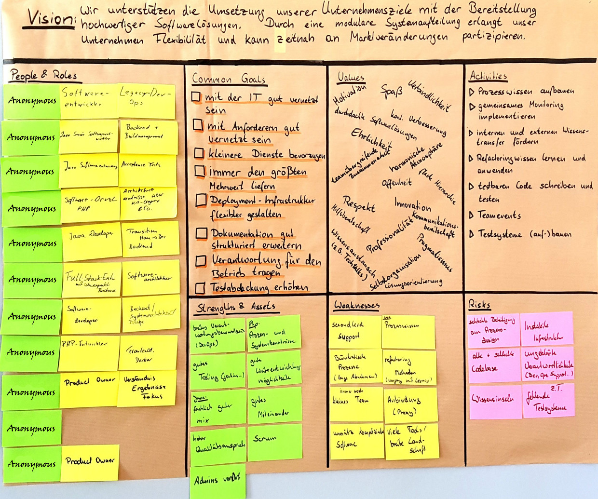

# Team Canvas

The team canvas summarizes our vision, goals, values, strengths, assets, weaknesses, risks, 
and activities we arrived from these. The original also lists our names and which roles we have.
This public version is anonymized to keep out of trouble with
[GDPR](https://en.wikipedia.org/wiki/General_Data_Protection_Regulation).

## Vision

We support reaching our company's goals by supplying high quality software solutions. By a modular
division of our software systems our company gains flexibility to react in time to changes of the
market.

## Common Goals
+ To have a good interconnection to the IT
+ To have a good interconnection to our stakeholders
+ Prefer smaller services
+ Always supply the best value
+ Make deployment infrastructure more flexible
+ Expand documentation in a structured way
+ Take over responsibility for software operations
+ Increase test coverage

## Values
+ Motivation
+ Fun
+ Commitment
+ Sophisticated software solutions
+ Continuous improvement
+ Honesty
+ Collaboration across team borders
+ Harmonic atmosphere
+ Openness
+ Flat hierarchies
+ Respect
+ Innovation
+ Helpfulness
+ Be willing to communicate
+ Professionalism
+ Exchange of knowledge
+ Pragmatism
+ Self organized
+ Solution oriented

## Strengths and Assets
+ Broad sense of responsibility (DevOps)
+ Good tooling (Jenkins etc.)
+ Good opportunities for (personal) development
+ Good mix of (technical) knowledge
+ Good togetherness
+ High quality requirement
+ Scrum
+ Admins on-site

## Weaknesses
+ Second level support
+ Process knowledge
+ Bureaucratic processes (long approvals)
+ Refactoring methods (handling legacy code)
+ Still small team
+ Network connectivity (Proxy)
+ Software needlessly complex
+ Many tools, broad landscape

## Risks
+ Bad participation in designing processes
+ Unstable infrastructure
+ Old and bad code base
+ Responsibilities not clear (Dev, Ops, Support)
+ Information silos
+ Partly missing test systems

## Activities
+ Build process knowledge
+ Implement monitoring together
+ Encourage internal and external knowledge transfer
+ Learn and use refactoring methods
+ Write testable code and test it
+ Team events
+ Build/extend test systems